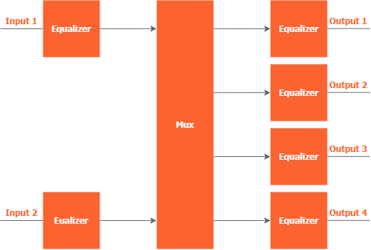
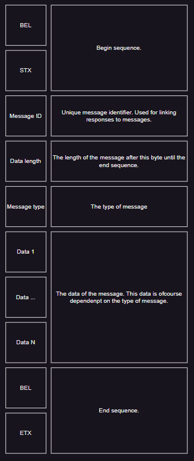
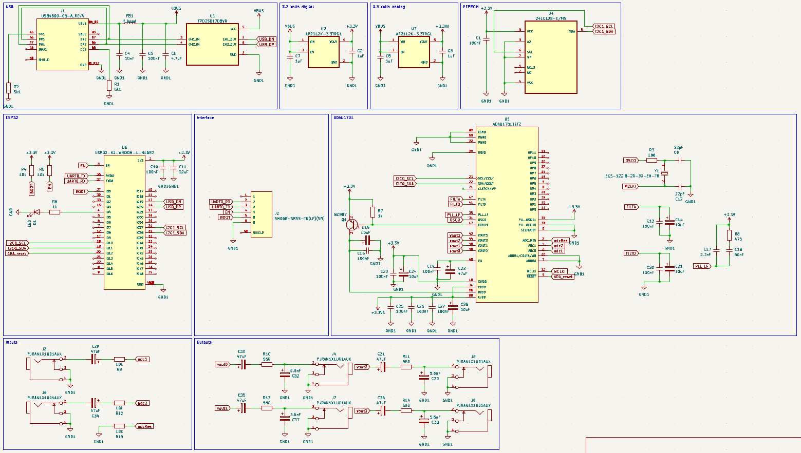
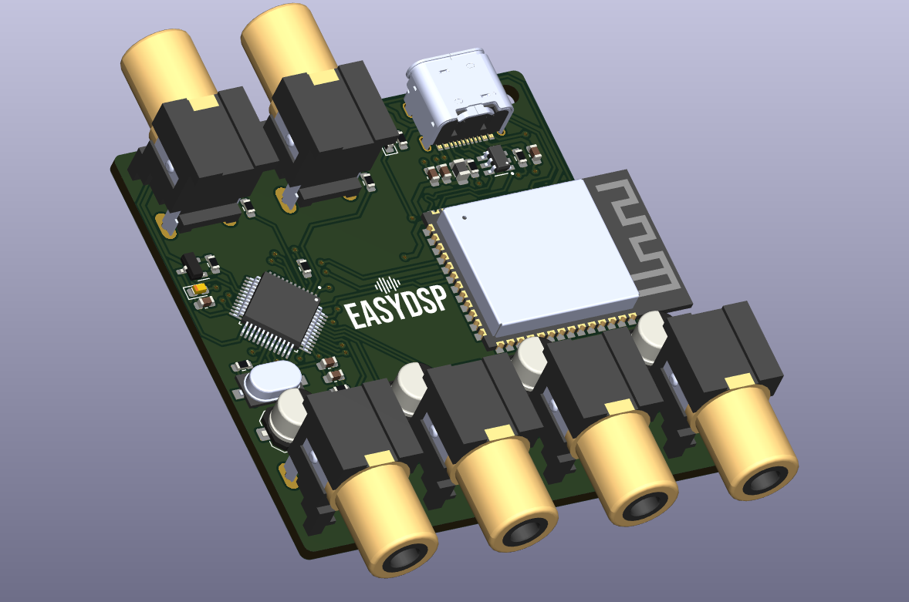
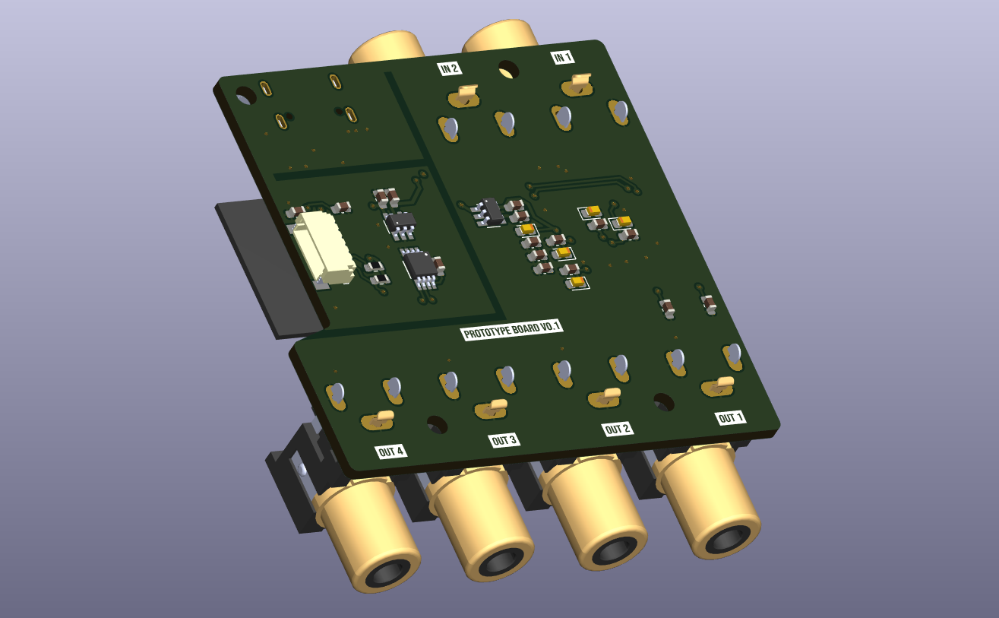

# EasyDSP prototype development branch.
This is the EasyDSP prototype development library. In this repository you will find the hardware of the EasyDSP as well as the corresponding firmware. In this readme you will find an explanation of how to firmware functions and how to control the EasyDSP using the corresponding communication protocol. Also, you will find the PCB schematics and PCB design without the need to have KiCad and all the corresponding components on hand.

## Table of contents:
- [EasyDSP prototype development branch.](#easydsp-prototype-development-branch)
  - [Table of contents:](#table-of-contents)
  - [Introduction ](#introduction-)
  - [Communication and protocol ](#communication-and-protocol-)
  - [Firmware ](#firmware-)
  - [Hardware ](#hardware-)

## Introduction 
The goal of this project is to make a cheap and easy to control module in order to do all your audio digital signal processing needs. The EasyDSP could be used for audio crossover, room correction, subwoofer tuning, using [Bass Eq](https://www.avsforum.com/threads/bass-eq-for-filtered-movies.2995212/) and much more. The goal of the project is to be able to control the EasyDSP using a USB or Bluetooth low energy connection. When connected easy commands can be used to control the EasyDSP. The basic structure of the signal processor can be explained with the following image:
  
The EasyDSP has two inputs and four outputs. The mux makes it possible to connect any input with any output. Every in and output has an equalizer to which five filters can be applied. 
The goal of the protoype is to implement the basic functioning of this system while doing it reliably. When this is achieved, functionality can be upgraded.

## Communication and protocol 
The EasyDSP can be controlled through one of the interfaces using it's own communication protocol. In this chapter the communication protocol is explained. The basic structure of a message is as follows:
  
The bottom table describes every message type you can send to the EasyDSP and with what message type the message will be responded with.

## Firmware 
Explain how to firmware is written.

## Hardware 
The EasyDSP is based on the ADAU1701 digital signal processor from Analog Devices. The chip is used in I2C control mode. This way, we can control the the signal processor from an external microcontroller during operation. The microcontroller used is an ESP32-S3 in the form a WROOM module to make development of the prototype hardware easier. The board and firmware have the ability to store the EQ, MUX and gain settings on an EEPROM. The EEPROM used is a 24LC128 in an MSOP package. Technically lower storage 24LC EEPROM's can also be used. In order to upload the firmware to the board, an external programmer with a USB to uart converter has to be used. There is an example board in the hardware folder. Following is the hardware schematic. The schematic can also be opened using KiCad.
  
The PCB fabrication files can be found in the hardware_design folder. Using these gerber and drill files you can order a PCB from a manufactorer.
  
  