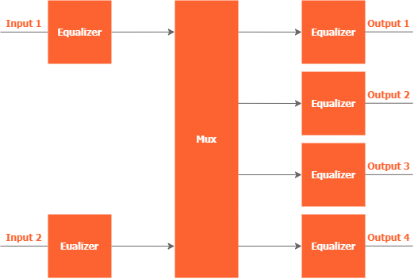
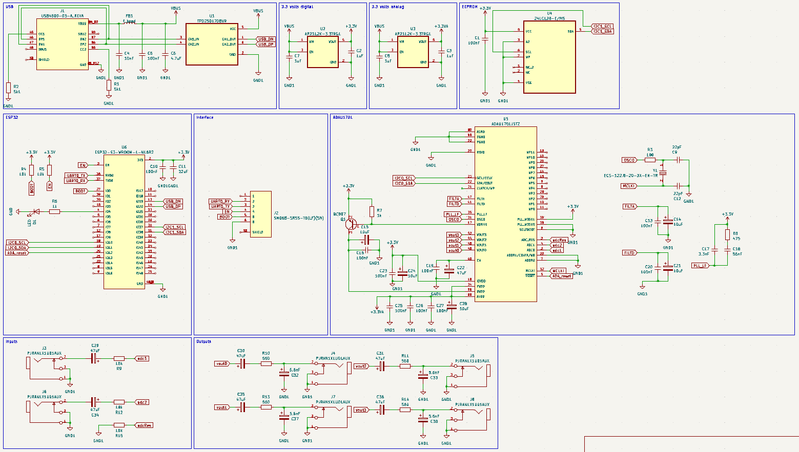
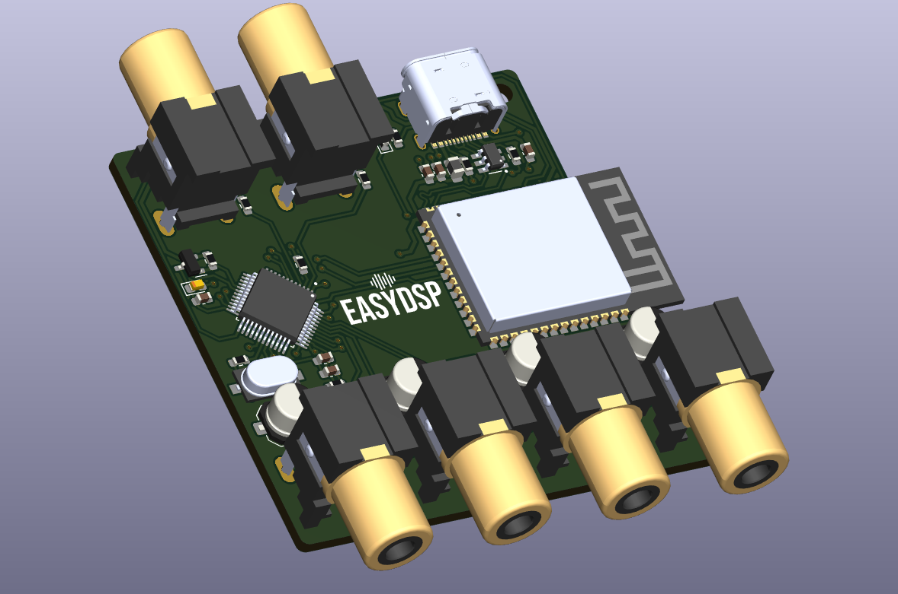
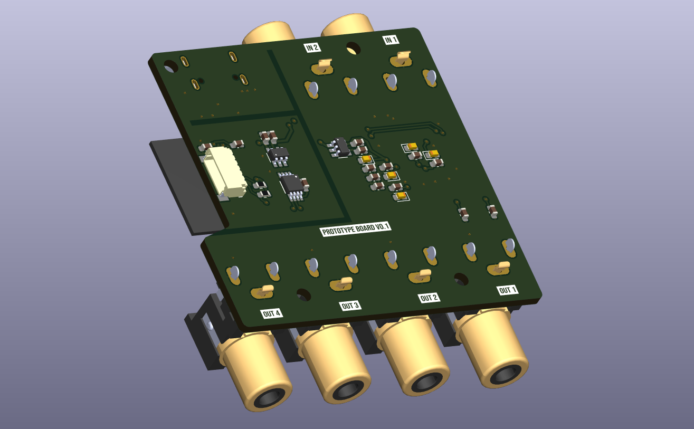

# EasyDSP prototype_dev v0.1 development branch.
This is the EasyDSP prototype development library. In this repository you will find the hardware of the EasyDSP as well as the corresponding firmware. In this readme you will find an explanation of how to firmware functions and how to control the EasyDSP using the corresponding communication protocol. Also, you will find the PCB schematics and PCB design without the need to have KiCad and all the corresponding components on hand.

This readme will be updated to display correct and relevant information depending on the branch.

## Table of contents:
- [EasyDSP prototype\_dev v0.1 development branch.](#easydsp-prototype_dev-v01-development-branch)
  - [Table of contents:](#table-of-contents)
  - [Introduction ](#introduction-)
  - [TODO list ](#todo-list-)
  - [Controlling via BLE. ](#controlling-via-ble-)
  - [Python. ](#python-)
  - [Hardware ](#hardware-)

## Introduction 
The goal of this project is to make a cheap and easy to control module in order to do all your audio digital signal processing needs. The EasyDSP could be used for audio crossover, room correction, subwoofer tuning, using [Bass Eq](https://www.avsforum.com/threads/bass-eq-for-filtered-movies.2995212/) and much more. The goal of the project is to be able to control the EasyDSP using a Bluetooth low energy connection. When connected BLE characteristics can be used to control the EasyDSP. The basic structure of the signal processor can be explained with the following image:
  
The EasyDSP has two inputs and four outputs. The mux makes it possible to connect any input with any output. Every in and output has an equalizer to which five filters can be applied. 
The goal of the protoype is to implement the basic functioning of this system while doing it reliably. When this is achieved, functionality can be upgraded.

## TODO list 

- Make the settings store on the EEPROM. ✅
- Implement more filters (Bessel?) for better low pass and high pass.
- Maybe improve Python module for this verstion.

Things to include in next version:
- Better PCB design to improve the noise in the audio signal coming from the Bluetooth antenna (External antenna?).
- RGB status indication LED.
- Case design. (3D printable).
- Start working on GUI app for desktop to control the device.
- More functionality in firmware, more filters and gain control. And overall cleanup. 
- Thinking about serial control via USB.

## Controlling via BLE. 
Easydsp can be controlled with a BLE connection. The BLE implements two different services. The first service is a "selection" service. With this service the channel and eq number that are desired to be changed can be selected. With the channel number characteriscic you can change the channel number. With the isOutput characteristic you can select if it is an input or output channel that is selected. With the eq characteristic you can selected one of the 5 eq's per channel that you wish to change te settings of.

The EQ service implements the EQ data of the selected EQ on the selected channel. This service has characteristics to change the behaviour of the selected EQ. 

## Python. 
Included is a simple python module, easydsp.py, that can be used to control the easydsp over a BLE connection. I have also included a simple Python command line program that uses this module to control the EasyDSP.

## Hardware 
The EasyDSP is based on the ADAU1701 digital signal processor from Analog Devices. The chip is used in I2C control mode. This way, we can control the the signal processor from an external microcontroller during operation. The microcontroller used is an ESP32-S3 in the form a WROOM module to make development of the prototype hardware easier. The board and firmware have the ability to store the EQ, MUX and gain settings on an EEPROM. The EEPROM used is a 24LC128 in an MSOP package. Technically lower storage 24LC EEPROM's can also be used. In order to upload the firmware to the board, the USB connector on the PCB can be used. Firmware can also be uploaded and monitored using an external USB to UART PCB connected to the connector on the main PCB. There is an example board in the hardware folder. Following is the hardware schematic. The schematic can also be opened using KiCad.
  
The PCB fabrication files can be found in the hardware_design folder. Using these gerber and drill files you can order a PCB from a manufactorer.
  
  